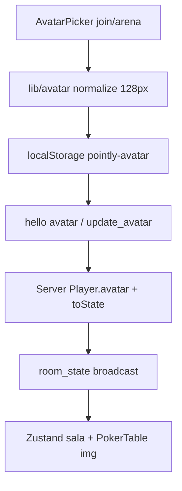

# Avatar na mesa Design

**Spec**: `.specs/features/avatar-perfil-mesa/spec.md`
**Status**: Draft

---

## Architecture Overview

Fluxo local-first: browser normaliza a imagem, persiste em localStorage e envia como dataURL no `hello`; troca mid-sala usa `update_avatar` com broadcast do snapshot. Sem storage novo.



---

## Code Reuse Analysis

### Existing Components to Leverage

| Component | Location | How to Use |
| --------- | -------- | ---------- |
| PlayerSchema / HelloPayload | `packages/shared/src/schemas/sala.ts:103`, `events.ts:26` | Estender com `avatar` opcional, mesmo padrão zod |
| handleHello + reconnect | `apps/server/src/handlers/hello.ts:48`, `hub.ts:184` | Incluir avatar no candidate + reidratação |
| WSService dispatch + broadcastRoomState | `apps/server/src/ws.ts:241`, `495` | Novo case `update_avatar` reaproveitando broadcast |
| identity + storage | `apps/web/src/lib/identity.ts:9`, `storage.ts:8` | Nova chave `pointly-avatar` com safeGet/safeSet |
| ws-client connect/hello | `apps/web/src/lib/ws-client.ts:161` | Incluir avatar no hello; novo send update_avatar |
| PokerTable + CSS círculo | `apps/web/src/components/poker-table.tsx:82`, `poker-table.css:58` | Render condicional img/cover, mesma âncora |
| Button, Field, Input coss | `apps/web/src/components/ui/*` | Picker com primitivos existentes |
| Testes hello/sala/ws-client | `handlers/hello.test.ts`, `lib/ws-client.test.ts` | Estender padrão bun test existente |

### Integration Points

| System | Integration Method |
| ------ | ------------------ |
| Wire C→S | `hello {avatar?}` + `update_avatar {avatar|null}` validados por zod no boundary |
| Wire S→C | `Player.avatar` dentro de `SalaState` via `room_state`/`welcome` existentes |
| Store client | `session.ts updateSala` hidrata sem mudança de forma |

---

## Components

### AvatarSchema (shared)

- **Purpose**: Validar dataURL com teto anti-abuso
- **Location**: `packages/shared/src/schemas/sala.ts` (novo export, reuso em `events.ts`)
- **Interfaces**:
  - `AvatarSchema: z.string().regex(/^data:image\/(jpeg|png|webp);base64,/).max(40000)`
- **Dependencies**: zod
- **Reuses**: padrão NickSchema/UuidSchema

### lib/avatar (web)

- **Purpose**: Normalizar arquivo para 128x128 JPEG q0.8 via canvas + crop central
- **Location**: `apps/web/src/lib/avatar.ts`
- **Interfaces**:
  - `normalizeAvatar(file: File): Promise<string>` - valida tipo/tamanho 5MB, retorna dataURL
  - `loadAvatar(): string | null` / `saveAvatar(dataUrl: string): void` / `clearAvatar(): void`
- **Dependencies**: `lib/storage.ts`, Canvas2D
- **Reuses**: safeGet/safeSet com fallback em memória

### AvatarPicker (web)

- **Purpose**: Input file escondido + preview circular + remover + erro inline
- **Location**: `apps/web/src/components/avatar-picker.tsx`
- **Interfaces**:
  - `AvatarPicker({value, onChange, compact?}: {value: string|null, onChange(v: string|null): void})`
- **Dependencies**: coss Button/Field, `lib/avatar.ts`
- **Reuses**: padrões de Field/erro de `pages/join.tsx`

### hello + update_avatar (server)

- **Purpose**: Aceitar avatar no join e em troca mid-sala com broadcast
- **Location**: `apps/server/src/handlers/hello.ts`, novo `handlers/update-avatar.ts`, `ws.ts` dispatch, `sala.ts` setAvatar
- **Interfaces**:
  - `handleHello(hub, {...payload, avatar?})` - ignora só o campo se acima do teto
  - `handleUpdateAvatar(hub, playerId, {avatar}): {ok} ` + broadcast `room_state`
- **Dependencies**: AvatarSchema, Hub/Sala
- **Reuses**: padrão outcome `{ok, code, message}` dos handlers de voto

### PokerTable avatar (web)

- **Purpose**: Exibir img cover no círculo com fallback iniciais
- **Location**: `apps/web/src/components/poker-table.tsx`, `.css`, `lib/protocol.ts` TablePlayer
- **Interfaces**:
  - `TablePlayer.avatar?: string | null`
- **Dependencies**: Player com avatar via room_state
- **Reuses**: mesma classe `.poker-avatar`, âncora `data-projectile-player`

### Join + Arena wiring (web)

- **Purpose**: Picker no join (com microcopy) e na arena ("Você é") + lista de espectadores
- **Location**: `apps/web/src/pages/join.tsx`, `pages/arena.tsx`
- **Interfaces**: `socket.connect(url, {uuid, nick, avatar?})`, `socket.updateAvatar(v)`
- **Dependencies**: AvatarPicker, lib/avatar, ws-client
- **Reuses**: fluxo saveNickDraft/saveSession existente

---

## Data Models (if applicable)

### Player.avatar

```typescript
avatar?: string | null // dataURL data:image/jpeg;base64,... teto ~40KB
```

**Relationships**: Opcional em Player, HelloPayload, PersistedSession e TablePlayer. Ausente ou null = iniciais. Reconnect reidrata junto com assento/voto.

---

## Error Handling Strategy

| Error Scenario | Handling | User Impact |
| -------------- | -------- | ----------- |
| Formato inválido / >5MB pré-processamento | Recusa client com erro inline no picker | Vê mensagem, join segue com iniciais |
| dataURL >40KB no zod (hello/update) | Ignora só o campo, aceita join/operação | Entra na sala com iniciais, sem erro fatal |
| localStorage cheio/indisponível | Fallback memória da sessão | Avatar vale na sessão, sem crash |
| img quebrada na mesa | onError → iniciais | Círculo nunca fica vazio |
| update_avatar sem playerId | error invalid_phase | Toast padrão, sem broadcast |

---

## Risks & Concerns

| Concern | Location (file:line) | Impact | Mitigation |
| ------- | -------------------- | ------ | ---------- |
| room_state incha x24 avatares | `apps/server/src/sala.ts:606` | Snapshot maior a cada broadcast | Teto 40KB + 128px (~8-15KB); sem full-size |
| PlayerJoined desatualizado sem avatar | `packages/shared/src/schemas/events.ts:140` | Toast/lista sem foto | Incluir avatar opcional ou documentar que player_joined não carrega imagem |
| Canvas indisponível (SSR/test) | `apps/web/src/lib/avatar.ts` (novo) | normalize quebra | Guard + fallback: recusa com erro inline, mantém iniciais |
| Teste sem cobertura de picker | `apps/web/src/pages/join.tsx:264` | Regressão visual | bun test para normalize + protocolo; verificação manual da mesa |

---

## Tech Decisions (only non-obvious ones)

| Decision | Choice | Rationale |
| -------- | ------ | --------- |
| dataURL no Player vs storage | dataURL 128px teto 40KB | Salas efêmeras, zero infra; ver ADR-0013 |
| update_avatar dedicado vs re-hello | Novo evento + broadcast | Troca visível sem reconnect; handler pequeno |
| Crop automático vs editor | Central + cover | YAGNI; editor manual fora do v1 |
